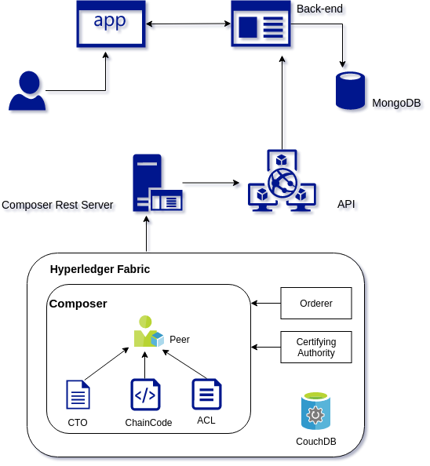
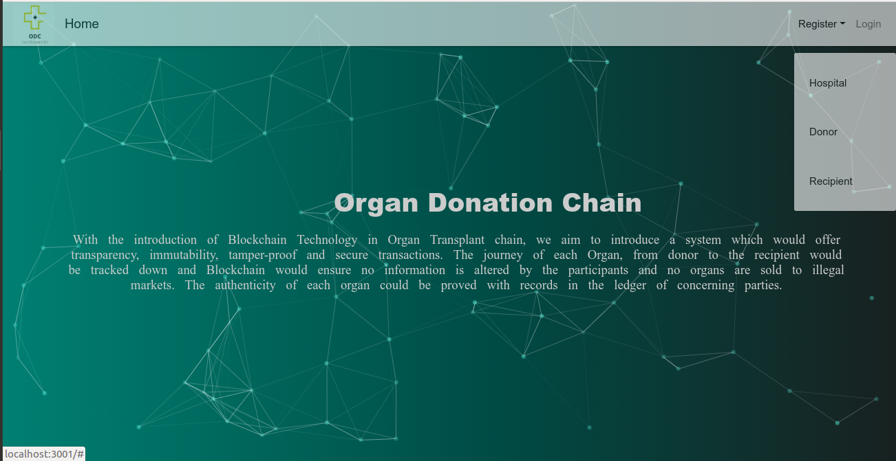
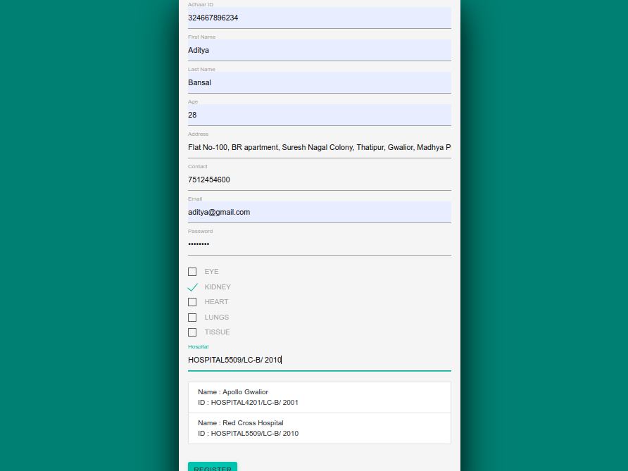
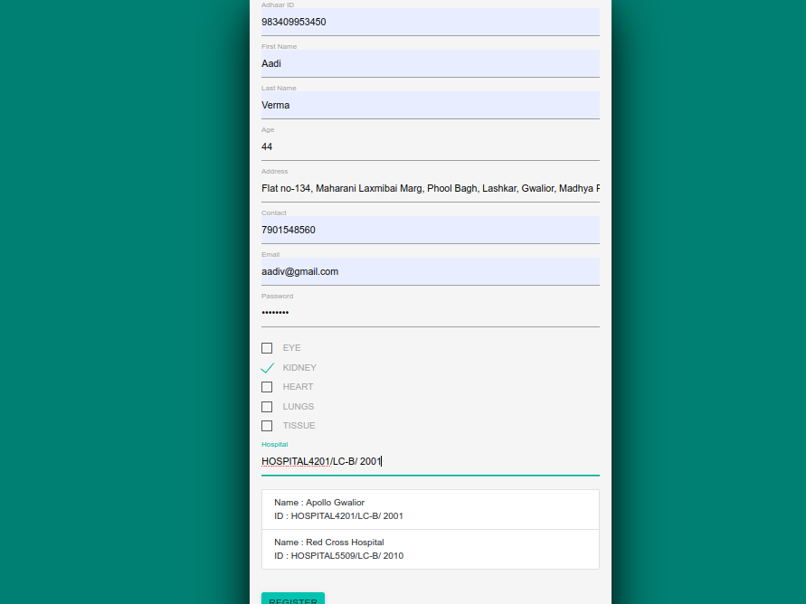
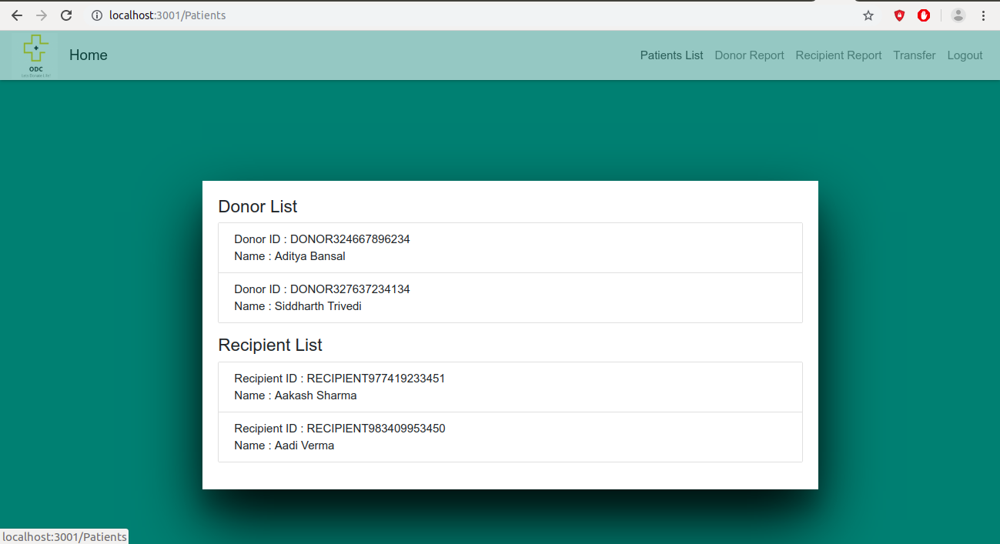
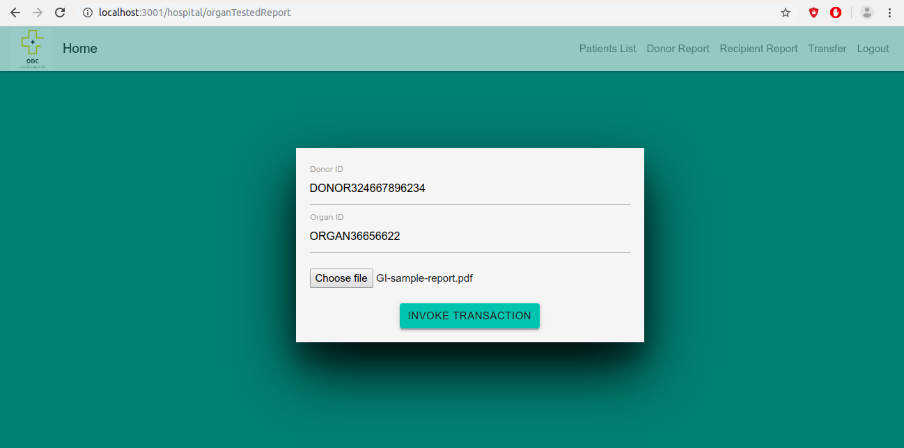
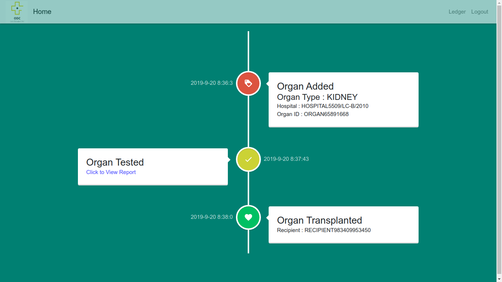
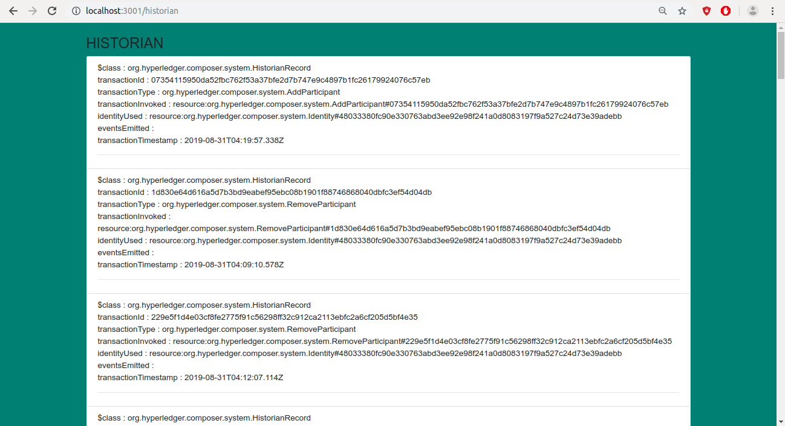

# Organ-Donation-Chain
## About Organ Donation Chain :
- Integrate Blockchain Technology and Organ Transplantchain to achieve a system that could guarantee privacy,transparency and immutability.
- Keep a detailed record and transaction history of eachaction performed by each party and hence to prevent any vulnerabilities caused by tampering or privacy related issues.
- Trace down any individual or party who attempts to gain profit or involve in prohibited or illegal transactions.

## Methodology


### Architecture of the Network :


The donors and the recipients registers themselves by filling in the necessary details.  When the donors and the recipients are registered, they are added as participants in the network. Hospitals in involved are also participants in our network. The Hospitals register themselves by providing necessary details. Each participant donor and recipient are registered under a hospital which will perform donation or transplant operation.

When a registered donor donates organ(s), the registered hospital of the donor updates information about the organ, creating an asset Organ in the network. The concerning hospital with permission of the donor can create the Organ asset, update organ information and upload necessary reports. Similarly, the recipient’s hospitals with the permission of the recipient can upload recipients report into the network to broadcast the request of the needed organ with specified details.

To get the organ needed by the patient,  the recipient’s hospital,  broadcasts the request by sending the report containing specifications of the organ needed to all hospitals of that specific organ. The hospitals to whom the request was broadcast reply with donors organ specification report. Finally, the recipients hospital send a confirmation after choosing the needed organ by running their custom algorithm for organ matching. These operations are expected to run on cloud while the blockchain would maintain the status of the assets and concerning participants ensuring that no illegal activities or false information updates are carried out.

## Screenshots

### Homepage


### Donor Registration


### Recipient Registration


### Hospital Registration


### Hospital Homepage


### Report Update


### Timeline of Patient


### Donor Api


### Historian
The historian records is the ledger we are maintaining using the blockchain.  It is an immutable and tamper proof records which are stored in the blockchain. It maintains all the records regarding the transactions performed in the network and all the commitment to the ledger.



## To run the project
- Start hyperledger fabric by 
```
./startFabric.sh
```
- Create a peer admin card
```
./createPeerAdminCard.sh
```
- Install the PeerAdmin card to .bna file
```
composer network install --card PeerAdmin@hlfv1 -a organ-donation-chain.bna
```
- composer network start 
```
composer network start -c PeerAdmin@hlfv1 -n organ-donation-chain -V <Version> -A admin -S adminpw
```
- Composer card import
```
composer card import -f admin@organ-donation-chain.card
```
- To launch Rest server
```
composer-rest-server
```
- To start React Application go to dir Organ-Donation-Chain/OrganChain/client_src/ 
and run
```
npm start
```
